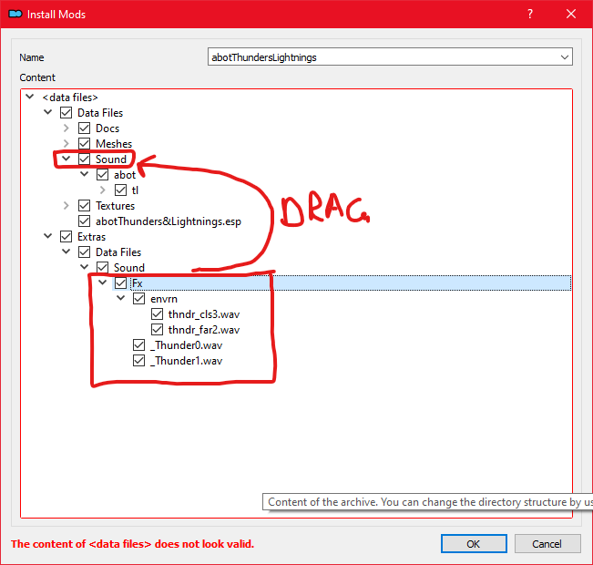

# Audio

⭐📃 [**AURA**](https://www.nexusmods.com/morrowind/mods/48255)\
Customizable sound overhaul which adds ambient sounds, interior weather, extended voices, and more.

* Files to install:
  * **AURA** (Main files)
  * **AURA** (Update files)

* On MO2 installation, check the following options in the installer:
  * [x] 00 Core
  * [x] 01 Replacer

⭐📃 [**Character Sound Overhaul**](https://www.nexusmods.com/morrowind/mods/49654)\
Customizable sound overhaul of the movement, combat, and item sounds of Morrowind. Unique, varied terrain-based footstep sounds, armor rattling sounds, new sounds for interacting with items, containers, and more.


The author recommends you set the **Footsteps** volume to minimum in your in-game audio settings.


## Voices

⭐ [**FMBP - Michael Michael Michael**](https://www.nexusmods.com/morrowind/mods/48598) by [PoodleSandwich2](https://www.nexusmods.com/morrowind/users/45710542)\
Fixes Michael Mack's misreadings of the word "Dunmer".

⭐ [**FMBP - Greet Service**](https://www.nexusmods.com/morrowind/mods/50937) by [PoodleSandwich2](https://www.nexusmods.com/morrowind/users/45710542)\
Makes it so service NPCs will greet you appropriatly.

⭐ [**Idle Talk**](https://www.nexusmods.com/morrowind/mods/46948)\
Adds over 200 new voice entries for NPCs, mostly using edited original voice files.

⭐ [**Voice Overhaul**](https://www.nexusmods.com/morrowind/mods/51215) by [PhoenixRime](https://www.nexusmods.com/morrowind/users/2250219)\
All dialogues with voice phrases in the game have been re-sorted. Restored many unused lines, increased the variety of audible phrases. Many bugs fixed.

## SFX

⭐📃 [**Heartthrum**](https://www.nexusmods.com/morrowind/mods/47178)\
The Heart of Lorkhan is still beating. You can hear it even on the surface - assuming you are brave (or foolish) enough to venture beyond the Ghostfence...

⭐ [**Outdoor Banners With Sound**](https://www.nexusmods.com/morrowind/mods/47068)\
Outdoor banners now play sound alongside their animations. The sound will vary depending on the weather.

[**No Female Nord Screeching**](https://www.nexusmods.com/morrowind/mods/49232)\
Replaces a handful of sound files to stop female Nords from bursting your ear drums when they are attacked.

[**Shut the Fuck up Cliff Racers**](https://www.nexusmods.com/morrowind/mods/46588)\
Reduces the frequency of idle Cliff Racer screeches.

[**Quieter Doors and Spells**](https://github.com/rfuzzo/MorrowindPlusPlus/blob/main/assets/Quieter%20Doors%20and%20Spells.7z)\
Reduces the volume of doors and spells. Mod by **Sigourn**.


[**External Link**](https://github.com/rfuzzo/MorrowindPlusPlus/raw/main/assets/Quieter%20Doors%20and%20Spells.7z) to the download.


[**Spell Sounds Enhanced**](https://www.nexusmods.com/morrowind/mods/46338)\
Vanilla-friendly replacer of each vanilla spell sound.

[**Thunders & Lightnings v1.3**](https://abitoftaste.altervista.org/morrowind/index.php?option=downloads&task=info&id=8&Itemid=50&-Thunders-Lightnings) by *abot*\
This is my (abot) "atmospheric" version of thunders & lightnings, inspired by
Jac's Lightning Strike mod.

* On MO2 installation, an installer window will pop up asking you to set a Data Files Directory.
* Drag the folder `Extras > Data Files > Sound > Fx` to `Data Files > Sound`
* Right click on `Data Files` and select "Set as < data files > directory".

[**Haunted Barrows**](https://www.nexusmods.com/morrowind/mods/46826)\
Gives Nord barrows their own unique sound. You will hear some deep-voiced chanting and perhaps some drums in the distance if you listen closely enough; hearkening back to ancient battles and burial rites.

* On MO2 installation, check the following options in the installer:
  * [x] 00 Core
  * [x] 01 Fire Sound Replacer

📃 [**Sounds of Souls**](https://www.nexusmods.com/morrowind/mods/45657)\
Soul gems in the world, in the player's inventory, and that the player interacts with will play sounds, corresponding to the creature trapped inside of it. This includes creatures added by mods.


Note that users often forget about installing this mod, leading to questions on why they hear creature sounds from time to time when none are found nearby.


[**Store Entrance Chimes**](https://www.nexusmods.com/morrowind/mods/44586)\
Adds entrance bell chimes with sound effects to imperial town tradehouses and taverns.

[**Tunnel Cough**](https://www.nexusmods.com/morrowind/mods/47603) by [Reizeron](https://www.nexusmods.com/morrowind/users/32410819)\
Makes Miner class NPCs cough.

[**Sound Spell Sound Effect**](https://www.nexusmods.com/morrowind/mods/43300) by [Reizeron](https://www.nexusmods.com/morrowind/users/32410819)\
With this plugin the player can hear an actual noise when he's under the effects of the Sound magic. Its volume depends on the total magnitude of the effect.

## Music

📃 [**MUSE 2 - Morrowind Music System Extended**](https://www.nexusmods.com/morrowind/mods/46200)\
Extended and flexible music system for Morrowind, allows you to easily customize your music as well as make new music mods.

📃 [**MUSE 2.0.2 Necro Sig Edit**](https://github.com/rfuzzo/MorrowindPlusPlus/blob/main/assets/MUSE%202.0.2%20Necro-Sig%20Edit.7z)\
Fixes a number of bugs with the original mod, and optimizes it by removing air/underwater specific music. Additionally restores the vanilla music for the introductory scene at the Imperial Prison Ship. Mod by **Necrolesian** and **Sigourn**.


[**External Link**](https://github.com/rfuzzo/MorrowindPlusPlus/raw/main/assets/MUSE%202.0.2%20Necro-Sig%20Edit.7z) to the download.


📃 [**MUSE Music Expansion - Sixth House**](https://www.nexusmods.com/morrowind/mods/51082)\
A 6th House music expansion of original tracks for the Morrowind MUSE mod, created using modern production techniques. Featuring 5 new exploration tracks, 4 new combat tracks, and 1 boss fight track.

📃 [**MUSE Music Expansion - Ashlander**](https://www.nexusmods.com/morrowind/mods/51255)\
An Ashlander music expansion of original tracks by be created for the Morrowind MUSE mod. Featuring 4 new exploration tracks, 3 new combat tracks, and a special location track that plays in the Cavern of the Incarnate.

📃 [**MUSE Music Expansion - Dwemer**](https://www.nexusmods.com/morrowind/mods/51169)\
A Dwemer music expansion of original tracks by be created for the Morrowind MUSE mod. Featuring 5 new exploration tracks and 4 new combat tracks.

* Files to install:
  * **MUSE Expansion - Dwemer (Vanilla - Tribunal)** (Main files)

📃 [**Tamriel Rebuilt - Original Soundtrack**](https://www.nexusmods.com/morrowind/mods/47254)\
Adds whole new soundtrack for Tamriel Rebuilt areas, with region based music, dungeons, cities and other.
