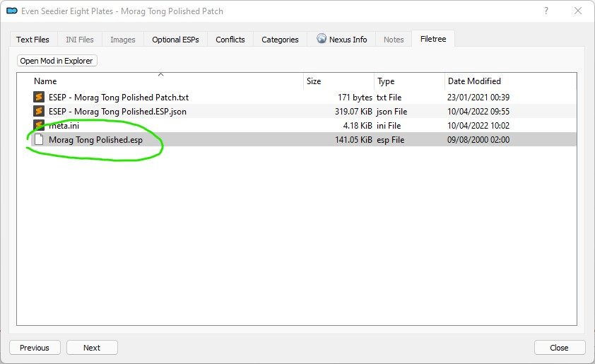

# Landscape and Towns

⭐ [**BCOM Rocky West Gash**](https://www.nexusmods.com/morrowind/mods/50565) by [alexpublius](https://www.nexusmods.com/morrowind/users/49943436)\
This is the maximum compatibility version of Rocky West Gash, especially for players using 'Beautiful Cities of Morrowind'. Now fully compatible with BCOM and all of its patches & replacers.


This needs to be installed before BCOM


⭐ [**Beautiful Cities of Morrowind**](https://www.nexusmods.com/morrowind/mods/49231) by [RandomPal](https://www.nexusmods.com/morrowind/users/59284071)\
 Overhaul of almost every settlement of Morrowind, inspired by concept art and aimed at a vanilla+ feeling.

* Files to install:
  * **Beautiful Cities of Morrowind - BCOM Core** (Main Files)

* On MO2 installation, check the following options in the installer:
  * [x] 00 Core
  * [x] 01 Haalu Council Hall Plaza - Izy Style
  * [x] 02 Riverside - Simple Cluttering
  * [x] 03 Plaza Weather Mechanics (MWSE) - Required
  * [x] 04 Suran dock epansion&clutter addon
  * [x] 05 White Suran
  * [x] 08 Expanded Sadrith Mora Dock

⭐📃 [**Boats**](https://www.nexusmods.com/morrowind/mods/42270) by [Abot](https://www.nexusmods.com/morrowind/users/38047)\
 You can travel by boat, ship and river strider in real time, and dismount anywhere in between trip starting and ending points

* Double click the mod in MO2 and go to the **Optional ESPs** tab, move to the left (make optional):
  * [x] `_abotBoatsWP.esp`
  * [x] `_abotRiverStridersWP.esp`
  * [x] `abotBoats.esp`

⭐📃 [**Gondoliers**](https://www.nexusmods.com/morrowind/mods/43291) by [Abot](https://www.nexusmods.com/morrowind/users/38047)\
 real time travel Vivec gondoliers

* Double click the mod in MO2 and go to the **Optional ESPs** tab, move to the left (make optional):
  * [x] `abotGondoliersRV.esp`
  * [x] `abotGondoliersRVWP.esp`
  * [x] `abotGondoliersWP.esp`

⭐📃 [**Silt Striders**](https://www.nexusmods.com/morrowind/mods/42267) by [Abot](https://www.nexusmods.com/morrowind/users/38047)\
 I wanted to travel Morrowind on top of a real Silt Strider so strongly, and after years waiting for some similar mod to be completed, I decided to try myself.

* Double click the mod in MO2 and go to the **Optional ESPs** tab, move to the left (make optional):
  * [x] `ab01NPCLCVSchedulesFix.esp`
  * [x] `abotSiltStriders.esp`

## Environment

⭐ [**Remiros' Groundcover**](https://www.nexusmods.com/morrowind/mods/46733) by [Remiros(Flash3113)](https://www.nexusmods.com/morrowind/users/899234)\
Adds groundcover to almost all regions.

* On MO2 installation, check the following options in the installer:
  * [x] 00 Core MGE XE
  * [x] 01b Thicker Grass MGE XE
  * [x] 03 TR Plugins

* Double click the mod in MO2 and go to the **Optional ESPs** tab, move to the left (make optional):
  * [ ] `Rem_Solstheim.esp`


After installation, disable all of the mod's plugins in your load order. ⚠️ **Do not hide or delete them**, as they are necessary for the mod to work as intended when generating Distant Land.



Distant Land generation is required to make this mod work as intended. Instructions will be given in the **Re-running Distant Land** section.


⭐📃 [**Adjustable Landscape Texture Scale**](https://www.nexusmods.com/morrowind/mods/49689) by [MelchiorDahrk](https://www.nexusmods.com/morrowind/users/962116)\
 This mod allows you to manually increase the scale of the landscape texture to make it look more detailed without the need for hi-res replacers.

⭐📃 [**Vanilla Land**](https://www.nexusmods.com/morrowind/mods/45953)\
 New hi-rez textures of all regions. Textures repeat the style of the original game, and using these textures you can recall your old experience of the journey through Valilla Land in 2k.

* Files to install:
  * **Vanilla Land v.1.1** (Main Files)

⭐ [**Better Waterfalls**](https://www.nexusmods.com/morrowind/mods/45424) by [MelchiorDahrk](https://www.nexusmods.com/morrowind/users/962116)\
New effects and textures for the waterfalls. Includes LOD on the particle effects to improve performance.

* On MO2 installation, check the following options in the installer:
  * [x] 00 Core
  * [x] 02 Tamriel Rebuilt Water

⭐ [**I Lava Good Mesh Replacer**](https://www.nexusmods.com/morrowind/mods/49605) by [MelchiorDahrk](https://www.nexusmods.com/morrowind/users/962116)\
Fixes flickering on lava. Reduces the occurrence of seams found in large lava pools. Adds performance friendly spark particle effects to lava pools.

* On MO2 installation, check the following options in the installer:
  * [x] 00 Core
  * [x] 02 Tamriel_Data Patch

⭐ [**I Lava Good Intelligent Textures Compatibility Patch - Fix**](https://www.nexusmods.com/morrowind/mods/51521)\
Compatibility Patch for "I Lava Good Mesh Replacer" by Melchior Dahrk with "Intelligent Textures" by Remiros.

⭐ [**Flies**](https://www.nexusmods.com/morrowind/mods/43481) by [Reizeron](https://www.nexusmods.com/morrowind/users/32410819)\
Adds a visual effect to all vanilla flies sound emitters.

⭐ [**Nocturnal Moths**](https://www.nexusmods.com/morrowind/mods/44148) by [Reizeron](https://www.nexusmods.com/morrowind/users/32410819)\
 Adds moths flying around some of the lanterns at night.

* Double click the mod in MO2 and go to the **Optional ESPs** tab, move to the left (make optional):
  * [x] `Nocturnal Moths - Vanilla.ESP`

⭐ [**Cave Drips**](https://www.nexusmods.com/morrowind/mods/43488) by [Reizeron](https://www.nexusmods.com/morrowind/users/32410819)\
 Adds a visual effect to all vanilla cave drip sound emitters.

⭐ [**Parasol Particles**](https://www.nexusmods.com/morrowind/mods/47755?tab=description) by [MelchiorDahrk](https://www.nexusmods.com/morrowind/users/962116)\
 Adds falling spores particle effects to the iconic emperor parasol mushrooms.

* On MO2 installation, check the following options in the installer:
  * Replacers -> none
  * Do you use Ashfall -> yes
  * Patches -> [x] OAAB Data

⭐📃 [**Unto Dust**](https://www.nexusmods.com/morrowind/mods/48435) by [MelchiorDahrk](https://www.nexusmods.com/morrowind/users/962116)\
Adds floating dust to areas where dead are entombed similar to what is seen in Skyrim barrows.

* On MO2 installation, check the following options in the installer:
  * [x] 00 Core
  * [x] 01 Default Dust

⭐📃 [**Heat Haze**](https://www.nexusmods.com/morrowind/mods/48973)  
Adds a heat haze shader. Subtle, gets faster and stronger when near lava pools.


The shader included in this mod needs to be registered in MGE XE to work as intended. Shader order will be given in the [**Shader setup**](/fundamentals/shaders.md#shader-setup) section.


⭐📃 [**Shattered Stones - An Earthquake Mod**](https://www.nexusmods.com/morrowind/mods/45105) by [Reizeron](https://www.nexusmods.com/morrowind/users/32410819)\
Adds recurring earthquakes to certain volcanically active regions of Vvardenfell. You'll hear the sounds of moving earth and breaking rocks, your screen will start to tremble with increasing intensity, and, if inside an interior, dust and particles will shake loose and fall from the walls and ceiling.


The shader included in this mod needs to be registered in MGE XE to work as intended. Shader order will be given in the [**Shader setup**](/fundamentals/shaders.md#shader-setup) section.


⭐ [**OAAB - Tombs and Towers**](https://www.nexusmods.com/morrowind/mods/49131)\
 A remake of tombs and velothi towers.

⭐ [**Know Thy Ancestors**](https://www.nexusmods.com/morrowind/mods/49678/)\
Every Ancestral Tomb in Vvardenfell has a unique banner displaying the family name in Daedric.

* Files to install:
  * **Know Thy Ancestors** (Main Files)
  * **Know The Ancestors - Tamriel Rebuilt Addon** (Optional Files)

[**Loot Well Urned**](https://www.nexusmods.com/morrowind/mods/44976)\
 Ancestral Tomb Loot Enhancement Mod

⭐ [**Caverns Overhaul - Fixed**](https://www.nexusmods.com/morrowind/mods/48683)\
RandomPal's random mods and patches
The original mod has a lot of great ideas but was never finished or fixed. Other mods make Cavern Overhaul an outdated mod anyway, but there's some locations that have not been covered by any other mod.

* Files to install:
  * **Caverns Overhaul - Fixed**

## Ascadian Isles

⭐ [**Concept Arts plantations**](https://www.nexusmods.com/morrowind/mods/50020)\
 A concept arts-based overhaul of the Arvel and Dren plantations.

* On MO2 installation, check the following options in the installer:
  * [x] 00 Core
  * [x] 02 - Remiros grass patch
  * [x] 03 - BcoM Remiros grass patch
  * [x] 05 - Ashfall Addon

⭐ [**Remiros' Ascadian Isles Trees 2**](https://www.nexusmods.com/morrowind/mods/45779)\
Replaces all of the trees in the Ascadian Isles region.

* Files to install:
  * **Remiros' Ascadian Isles Trees - Vanilla**

[**Concept Art Palace (Vivec City)**](https://www.nexusmods.com/morrowind/mods/48136)\
 The Concept Art Palace mod (C.A.P.) is my attempt to bring the Vivec palace closer the original Kirkbride's concept art.

* On MO2 installation, check the following options in the installer:
  * [x] 00 - Core Files
  * [x] 05 - GitD - patch

[**Vivec Palace Water Replacer**](https://www.nexusmods.com/morrowind/mods/48291) by [Anumaril21](https://www.nexusmods.com/morrowind/users/60236996)\
Replaces the water in the Palace of Vivec's canals using the animation method and textures of Tamriel Rebuilt's water statics. Two versions included, one with the original color and one made more blue.

* Files to install:
  * **Vivec Palace Water Replacer**

* On MO2 installation, check the following options in the installer:
  * [x] 00 Core
  * [x] 01 Original Color

[**Prerelease Prisonmoon**](https://www.nexusmods.com/morrowind/mods/49627)\
 Adds some more clutter to the ministry of truth inspired by early screenshots and concept art.

	
Alternatives

* [Baar Dau](https://www.nexusmods.com/morrowind/mods/49456)
* [Meteorite Ministry](https://www.nexusmods.com/morrowind/mods/45506)
* [Baar Dau - Ministry of Truth](https://www.nexusmods.com/morrowind/mods/50877)

[**ReadMe - Library of Vivec Overhaul**](https://www.nexusmods.com/morrowind/mods/49916)\
This mod redesigns the Library of Vivec from scratch to make it look and feel like a true library, with many books added from Tamriel_Data and OAAB_Data for you to read. There are also new NPCs for you to interact with, and two new quests that set you on the hunt for a unique book the resource for which was provided by RubberMan.

[**Glass Domes of Vivec - Performance-friendly Open-ish Cantons**](https://www.nexusmods.com/morrowind/mods/48935)\
Replaces the tops of Vivec's cantons with "glass" domes, so that the plaza interiors are gloriously lit by daylight and aren't as miserable. They will react to weather and night time, ALSO.

[**Glass Domes of Vivec - Moonrain Edition**](https://www.nexusmods.com/morrowind/mods/48946)\
Community expansion to Glass Domes of Vivec - visual fixes, new region mechanics, and more.

* On MO2 installation, check the following options in the installer:
  * [X] 00 Core Visual Assets
  * [X] 01 Glow in the Dahrk Patch - flickering
  * [X] 01 Optional Green Glow for GitD Patch - flickering
  * [X] 02 New Weather Mechanics (requires MWSE)
  * [X] 07 Optional Thinner Interior Texture

[**Guar Stables of Vivec**](https://www.nexusmods.com/morrowind/mods/50118) by [RandomPal](https://www.nexusmods.com/morrowind/users/59284071)\
 Adds guar stables to Vivec

* On MO2 installation, check the following options in the installer:
  * [x] 00 Core
  * [x] 01 Guar Stables

📃 [**Ebonheart Underworks**](https://www.nexusmods.com/morrowind/mods/47272)\
 Ebonheart now has its own sewage system. With filth, rats, people and quests.

[**Big Imperial Halls**](https://www.nexusmods.com/morrowind/mods/47533)\
 2 small mods using new interior tiles for the In_ImpBig set making larger open areas possible.

* Double click the mod in MO2 and go to the **Optional ESPs** tab, move to the left (make optional):
  * [x] `Imp_Big_4way.ESP`

[**Severa Magia DB Fix**](https://www.nexusmods.com/morrowind/mods/45647) by [Corsair83](https://www.nexusmods.com/morrowind/users/23131859)\
 Updates Severa Magia's hideout to look and feel more like a DB sanctuary.

## Ashlands

⭐ [**OAAB - The Ashen Divide**](https://www.nexusmods.com/morrowind/mods/49047)\
 Transforms the Ashlands pass between Seyda Neen and Balmora.

⭐ [**The Dream is the Door**](https://www.nexusmods.com/morrowind/mods/47423)\
To align with what the in-game dialogue suggests, the entrance to the Cavern of the Incarnate will now only be visible during the magical hours of twilight.

[**Strider Burial**](https://www.nexusmods.com/morrowind/mods/47661)\
 Strider Burial is an overhaul of the area containing a few Strider husks East of Urshilaku Camp, turning the zone in a small Silt Strider graveyard complete with an optional high-level unmarked quest.

* On MO2 installation, check the following options in the installer:
  * [x] 00 Core
  * [x] 01 For Vanilla Rocks

[**Faces of Vel - Ash Mire**](https://www.nexusmods.com/morrowind/mods/44200)\
 Adds a large mud pit in the foyada south of Bthuand and Zergonipal.

* On MO2 installation, an installer window will pop up asking you to set a Data Files Directory.
* Right click on `Data Files` and select "Set as < data files > directory".

[**The magic rock of Maar Gan**](https://www.nexusmods.com/morrowind/mods/50763)\
 Experience the Maar Gan shrine as the sacred place it should have been.

* On MO2 installation, check the following options in the installer:
  * [x] 00 Core
  * [x] 03- Ashfall add-on

[**Salt Gems of Bensamsi**](https://www.nexusmods.com/morrowind/mods/45126) by [MelchiorDahrk](https://www.nexusmods.com/morrowind/users/962116)\
 His methods are atypical, but an Argonian in the Sixth House base of Bensamsi has discovered a way to create soul gems from ash salts. Talk to Heem-La in the Ald-ruhn Guild of Mages about research opportunities if you would like to learn more.

[**Cavern Of The Incarnate Overhaul**](https://www.nexusmods.com/morrowind/mods/42860)\
 Cavern of the Incarnate overhaul + optional pluginless replacer of the cavern and the statue meshes

* Files to install:
  * **Cavern of the Incarnate Overhaul** (Main Files)

[**The Beacon of St Rilms**](https://www.nexusmods.com/morrowind/mods/49515)\
 Along the path between Ald-Ruhn and Ghostgate is a place of rest for those walking their pilgrimage, owned and operated by House Redoran as a gift to the people.

[**Valley of the Wind Atmospheric Enhancements**](https://www.nexusmods.com/morrowind/mods/47563) by [Lucevar](https://www.nexusmods.com/morrowind/users/3099525)\
 According to Ashlander dialogue, the Valley of the Wind is rarely travelled because the spirits there are restless. This mod adds haunting sound effects and removes fences from the Valley of the Wind, because really - who would bother to put them there?

## Azura's Coast

⭐ [**OAAB Tel Mora**](https://www.nexusmods.com/morrowind/mods/46177) by [MelchiorDahrk](https://www.nexusmods.com/morrowind/users/962116)\
 OAAB Tel Mora enhances the city of Tel Mora by adding new buildings, new quests, detailing the landscape, and more. It accomplishes all this while staying lore friendly and without (in my opinion) going over the top by making the city too big.

* On MO2 installation, check the following options in the installer:
  * [x] 00 Core
  * [x] 01 Female Guards

[**Holamayan Island**](https://www.nexusmods.com/morrowind/mods/50996)\
 A simple mod that adds a few details to the monastery island.

[**ShrineOfAzura**](https://www.nexusmods.com/morrowind/mods/48278)\
 This mod populates the Shrine of Azura on the Azura's Coast with some pilgrims and a priestess along with some other edits.

[**The Slavers Spire**](https://www.nexusmods.com/morrowind/mods/50662)\
 Adds a Telvanni lighthouse to the waters near Sadrith Mora and Tel Aruhn.

[**Telvanni Sea Beacons**](https://www.nexusmods.com/morrowind/mods/50957)\
 A series of navigation beacons along the length of the Azuras Coast.

[**The Telvanni Ward Keepers**](https://www.nexusmods.com/morrowind/mods/50078)\
Near Sadrith Mora is a series of ancient pillars, rumoured to be a long abandoned prototype of the Ghostfence built by a young Sotha Sil and now adopted by House Telvanni. Though nowhere near as great as the true Ghostfence they at least slow the spread of the blight winds, keeping the Telvanni mainland safe.

[**The Corprusarium experience**](https://www.nexusmods.com/morrowind/mods/49738) by [Vegetto88](https://www.nexusmods.com/morrowind/users/4655319)\
  Overhaul of the corprusarium, making it the creepy place it was meant to be.

* On MO2 installation, check the following options in the installer:
  * [x] 00 Core

[**RR Mod Series - Melchiors Mudcrab Merchant**](https://www.nexusmods.com/morrowind/mods/42685)\
This mod is a model and texture replacer for the Mudcrab Merchant, making him stand out against the other mudcrabs in a classy way.

[**Stormkiss Reforged**](https://www.nexusmods.com/morrowind/mods/44565)\
 This mod overhauls the burial of Olmgerd the Outlaw with proper Journal Indexing, a new armor set, and a remake of Storm Kiss.

[**Moody Magas Volar**](https://www.nexusmods.com/morrowind/mods/49789)\
  A complete overhaul of Magas Volar.

[**Forge of Hilbongard**](https://www.nexusmods.com/morrowind/mods/43222)\
 This little mod tweaks the Forge of Hilbongard slightly to make it a little more unique. The pictures show pretty much all the current changes.

[**RR Mod Series - Telvanni Lighthouse Tel Branora**](https://www.nexusmods.com/morrowind/mods/42664)\
 This mod adds a Telvanni style Lighthouse to Tel Branora.

* On MO2 installation, check the following options in the installer:
  * [x] 00 - Main Files
  * [x] 01 - Main ESP - English

[**Telvanni Council House Lounge Room**](https://www.nexusmods.com/morrowind/mods/49285) by [RandomPal](https://www.nexusmods.com/morrowind/users/59284071)\
Adds a new room in the Telvanni Council House where the player, and the other npcs, can relax, sleep and eat.

## Bitter Coast

⭐📃 [**Glowbugs**](https://www.nexusmods.com/morrowind/mods/50538) by [MelchiorDahrk](https://www.nexusmods.com/morrowind/users/962116)\
Adds firefly-like insects called glowbugs across the Bitter Coast region which come out on calm nights. They can be caught by the agile adventurer and their thorax makes a quality component in potions of Light.

* On MO2 installation, check the following options in the installer:
  * [x] 00 Core
  * [x] 01 Glowbugs BC
  * [x] 02 Glowbugs AI

	
Alternatives

⭐ [**Fireflies**](https://www.nexusmods.com/morrowind/mods/51443) by [RandomPal](https://www.nexusmods.com/morrowind/users/59284071)\
Adds fireflies around the Bitter Coast and the Ascadian Isles

⭐ [**Mistify**](https://www.nexusmods.com/morrowind/mods/48112) by [MelchiorDahrk](https://www.nexusmods.com/morrowind/users/962116)\
Enhances the ambiance of the Bitter Coast by adding a new mist effect throughout region which appears during the night and certain weather conditions. It will burn off in the morning sun.

* On MO2 installation, check the following options in the installer:
  * [x] 00 Core
  * [x] 01 Vanilla Mist Replacer

[**Andrano Ancestral Tomb Remastered**](https://www.nexusmods.com/morrowind/mods/44672)\
 An overhaul for the second main quest and its associated dungeon.

[**Samarys Ancestral Tomb Expanded**](https://www.nexusmods.com/morrowind/mods/45612)\
 An ancient burial lies in ruins outside of Seyda Neen – the few who know of the secrets it holds guard them closely, and the tomb lays all but forgotten.

[**Hlormaren Reclaimed - Slightly Improved**](https://www.nexusmods.com/morrowind/mods/47301) by [AliceL93](https://www.nexusmods.com/morrowind/users/4709296)\
 You encounter an old knight outside Hla Oad, with a seemingly menial quest for you - to clear out the bandits in Hlormaren. Little do you know there is more to this old knight and his motives than you expected...

[**Justice for Khartag (J.F.K.)**](https://www.nexusmods.com/morrowind/mods/49832) by [Vegetto88](https://www.nexusmods.com/morrowind/users/4655319)\
 Changes Khartag Point making it the high peak described in the in-game dialogues.

[**Of Dungeons and Abodes**](https://www.nexusmods.com/morrowind/mods/44253) by [darkelfguy](https://www.nexusmods.com/morrowind/users/19250)\
A distraught nephew, a missing uncle, a manor slowly sinking into the swamps of the Bitter Coast, and numerous secrets and hidden dungeons lurking just beneath the surface. Do you have what it takes to tame Velodil Manor and claim it as your own? Of Dungeons and Abodes is a dungeon delving, quest story telling, house building mod.

[**Expedition to Mzelthuand**](https://www.nexusmods.com/morrowind/mods/45229) by **Greatness7 - Melchior Dahrk - TheDrunkenMudcrab**\
 Off the shoreline of the Bitter Coast region, a Dwemer Ruin has appeared. Take up your spells and delve into the deepest and darkest of Dwemer mysteries within an enigmatic study facility that holds far more than it lets on.

* Files to install:
  * **Expedition to Mzelthuand** (Main files)
  * **Expedition to Mzelthuand - Cleaned Melchior Dahrk** (Optional files)

[**Morrowind Swamp Trees**](https://www.nexusmods.com/morrowind/mods/50151) by [Vegetto88](https://www.nexusmods.com/morrowind/users/4655319)\
 Reworks MD Grath trees in Bitter Coast to make them more vanilla friendly.

* On MO2 installation, check the following options in the installer:
  * [x] 00 Core
  * [x] 02 Huge Roots trees variation

[**Seamless abandoned shack**](https://www.nexusmods.com/morrowind/mods/49527) by [RandomPal](https://www.nexusmods.com/morrowind/users/59284071)\
 Seamless Abandoned shack built in the exterior cell.

[**Shal Overgrown**](https://www.nexusmods.com/morrowind/mods/47219) by [Danae123](https://www.nexusmods.com/morrowind/users/1233897)\
 Travel to Shal and discover its secrets: the once small cave is now overgrown and even reaches into the nearby Daedric ruin Ashurnibibi.

## Grazelands

⭐ [**OAAB Grazelands**](https://www.nexusmods.com/morrowind/mods/49075) by [MelchiorDahrk](https://www.nexusmods.com/morrowind/users/962116)\
 This mod is an overhaul of Vos and Tel Vos, the land surrounding them, the two nearby egg mines, covering a large portion of the northern Grazelands. Currently, the mod does not cover the entire Grazelands region, but additional work is planned in future updates. The mod includes 16+ new quests with approximately 18,000 words of dialogue.

* On MO2 installation, check the following options in the installer:
  * [x] 00 Core
  * [x] 01 Remiros Groundcover GL Patch

⭐ [**Melchior's Excellent Grazelands Acacia**](https://www.nexusmods.com/morrowind/mods/51058) by [MelchiorDahrk](https://www.nexusmods.com/morrowind/users/962116)\
A pluginless replacer for the Grazelands trees inspired by the umbrella thorn acacia species.

* On MO2 installation, check the following options in the installer:
  * [x] 00 Core
  * [x] 01 OAAB Saplings Patch

[**RR Mod Series - Telvanni Lighthouse Tel Vos**](https://www.nexusmods.com/morrowind/mods/42744)\
 This mod adds a Telvanni style Lighthouse not far from Tel Vos and Tel Mora.

* Files to install:
  * **Telvanni Lighthouse - Tel Vos** (Main files)
  * **Telvanni Lighthouse - Tel Vos Patch** (Update files)

* On MO2 installation, check the following options in the installer:
  * [x] 00 - Main Files
  * [x] 01 - Main Files GITD Patch
  * [x] 02 - Main ESP - English

[**Better Dwemer Interiors**](https://www.nexusmods.com/morrowind/mods/50193)\
Overhauls Dwemer ruins so that they are more memorable, more fun to explore, and ultimately more rewarding without being unbalanced or overcluttered.

* Files to install:
  * **BDI - Nchuleft** (Main files)
  * **Better Dwemer Interiors Master** (Main files)
  * **BDI master update** (Update files)

[**Fixed Falensarano**](https://www.nexusmods.com/morrowind/mods/48683)\
This is a small edit to the mod Falensarano - The ruined stronghold where landscape edits have been removed for compatibility.
There were also dirty edits that have been removed and some small tweaks here and there.

* Files to install:
  * **Fixed Falensarano** (Main files)

## Molag Amur

⭐ [**Sloadic Transports**](https://www.nexusmods.com/morrowind/mods/50546) by [RealAshstaar](https://www.nexusmods.com/morrowind/users/48605)\
 Sloadic Cargo Transports have arrived at Molag Mar. One is docked at the strider port and one will fly a route north of Molag Mar. There is a standard version and a necro version. Use only one .esp file.
A very good place to view the flying airship is from the northeast corner of the Molag Mar canton.

* Double click the mod in MO2 and go to the **Optional ESPs** tab, move to the left (make optional):
  * [x] `Sloadic Transport Necro.ESP`

[**Maren's Misfit Mabrigash**](https://www.nexusmods.com/morrowind/mods/48709)\
 Explore a revamped Maren Ancestral Tomb in search of a mysterious Ashlander outcast. Part of the Summer Modjam 2020.

 [**Marandus Rebuilt**](https://www.nexusmods.com/morrowind/mods/49522) by [EndoranWest](https://www.nexusmods.com/morrowind/users/44230747)\
The once generic stronghold of Marandus has now been given a facelift to truly show that it's now a Redoran conquest.

 [**Ashunartes Overhaul**](https://www.nexusmods.com/morrowind/mods/50049)\
 This mod overhauls the shrine of Ashunartes, adding more to explore.

## Sheogorad

⭐ [**Nordic Dagon Fel**](https://www.nexusmods.com/morrowind/mods/49603) by [RandomPal](https://www.nexusmods.com/morrowind/users/59284071)\
 Subtle changes to make the nordic village of Dagon Fel...nordic

⭐ [**The Grove of Ben'Abi**](https://www.nexusmods.com/morrowind/mods/46137) by [Remiros(Flash3113)](https://www.nexusmods.com/morrowind/users/899234)\
Small expansion to the mushroom grove near Dagon Fel.

⭐ [**Gray North - Ruined Redaynia**](https://www.nexusmods.com/morrowind/mods/49862) by [Anumaril21](https://www.nexusmods.com/morrowind/users/60236996)\
 Implements the cut village of Ald Redaynia and overhauls the nearby Velothi tower it's named for, expanding on existing content as well as adding an optional unmarked quest.

* On MO2 installation, check the following options in the installer:
  * [x] 00 Core
  * [x] 01 GITD Patch

[**Gray North - Andavel-Assumanu**](https://www.nexusmods.com/morrowind/mods/51326) by [Anumaril21](https://www.nexusmods.com/morrowind/users/60236996)\
 Overhauls the Andavel Ancestral Tomb and nearby Assumanu caverns, expanding on existing content as well as adding an optional objective.

[**Ancient Foes**](https://www.nexusmods.com/morrowind/mods/44705) by [darkelfguy](https://www.nexusmods.com/morrowind/users/19250)\
To the west and slightly north of Dagon Fel, you'll find a small cottage along the shores of the Sheogorad, where a young Nord spends his days longing for home. Will you help him find what he seeks? Or will you be the instrument of his destruction?

[**Sanctus Shrine**](https://www.nexusmods.com/morrowind/mods/47841) by [hater8](https://www.nexusmods.com/morrowind/users/57926276)\
 Minor cosmetic changes to the Sanctus Shrine.

[**Dagon Fel Mill Redux**](https://www.nexusmods.com/morrowind/mods/50067) by [RandomPal](https://www.nexusmods.com/morrowind/users/59284071)\
 Cleaned, fixed and improved version of the Dagon Fel Mill mod

[**Ashmelech Reborn**](https://www.nexusmods.com/morrowind/mods/45648) by [istred](https://www.nexusmods.com/morrowind/users/2476481)\
 This mod improves Ashmelech from being a largely empty ruin to a place worthy of being the clansted of the Aundae. More furniture, lights, services.

[**The Weary Vampire**](https://www.nexusmods.com/morrowind/mods/49774) by [OperatorJack](https://www.nexusmods.com/morrowind/users/61791411)\
 This mod overhauls Drethan Ancestral Tomb, transforming it into a much larger location that can be used as a player home after completing the quest, "The Weary Vampire."

[**Spines of Madness**](https://www.nexusmods.com/morrowind/mods/50947) by [malbogatra](https://www.nexusmods.com/morrowind/users/3785301)\
 A new look for Sheogorad - a gloomy, deserted and abandoned region on the edge of the inhabited world.

## West Gash

⭐ [**New Ilunibi**](https://www.nexusmods.com/morrowind/mods/50393) by [seelof](https://www.nexusmods.com/morrowind/users/4139826)\
 This mod rebuilds the mainquest dungeon Ilunibi from scratch to make it larger, more imposing and more interesting to explore. It also adds four new quests for you to discover and embark upon.

* Files to install:
  * **New Ilunibi**
  * **Patch for Main Quest Overhaul and Sixth House Smugglers** (Optional files)

⭐ [**Foyada Mamaea Overhaul**](https://www.nexusmods.com/morrowind/mods/46424) by [Remiros(Flash3113)](https://www.nexusmods.com/morrowind/users/899234)\
 Completely overhauls Foyada Mamaea.

* On MO2 installation, check the following options in the installer:
  * [x] 00 Core

⭐ [**Mamaea Awakened**](https://www.nexusmods.com/morrowind/mods/46096) by [MelchiorDahrk](https://www.nexusmods.com/morrowind/users/962116)\
 In vanilla Morrowind, Mamaea is a dull maze of caves with nothing remarkable about them aside from the spine of bone down the center of the cavern network. This mod aims to make Mamaea a more memorable visit for the player.

⭐ [**Of Eggs and Dwarves - Gnisis Eggmine and Bethamez Overhaul**](https://www.nexusmods.com/morrowind/mods/51171)by [seelof](https://www.nexusmods.com/morrowind/users/4139826)\
This mod rebuilds and expands the Gnisis Eggmine complex from scratch, which includes the Eggmine, the Lower Eggmine, the Underground Stream, and Bethamez. It also adds a quest, which asks the player to investigate the origins of the tremors that have been plaguing the eggmine ever since the Dwemer ruin was uncovered. Features actual earth quakes!

* On MO2 installation, check the following options in the installer:
  * [x] 00 Core
  * [x] 01 BCOM Patch

[**The Island - Aln'Baldrahn**](https://www.nexusmods.com/morrowind/mods/43187) by [MelchiorDahrk](https://www.nexusmods.com/morrowind/users/962116)\
 This mod adds a beautiful new island to the West Gash Region near Khuul. I actually made this mod as my interior/exterior showcase for the Tamriel Rebuilt project but I spent so much time on it and I liked it so much that I thought I would release it here for others to enjoy.

[**Berandas Overhaul**](https://www.nexusmods.com/morrowind/mods/48236) by [seelof](https://www.nexusmods.com/morrowind/users/4139826)\
 This mod overhauls and slightly expands the old Dunmer fortress Berandas near Gnisis. Daedra have claimed Berandas, but other than the few roaming Daedra themselves there is not much evidence of the corruption. With this mod, old daedric structures have risen from the deep to transform the fortress into a proper daedric stronghold.

[**Vorar Helas' Basement**](https://www.nexusmods.com/morrowind/mods/49313)\
 Adds a basement to Vorar Helas' house, with a small skooma (alchemy) lab, a bookshelf and some storage.

[**Windmill in Caldera v1.0**](https://mw.modhistory.com/download-80-6218) by **ayse**\
This mod add two charming windmill immediately northwest of Caldera. You simply can't miss them. Inside the mill is a simple hammock if you need a free nap.

[**Andasreth Stronghold - dungeon and exterior overhaul**](https://www.nexusmods.com/morrowind/mods/46604)\
 Rebuilds Andasreth stronghold and its exterior area.

## Solstheim

⭐ [**Solstheim - Tomb of the Snow Prince**](https://www.nexusmods.com/morrowind/mods/46810)  
Worldspace overhaul of Solstheim, improving the graphical fidelity, environmental design, and gameplay of the Bloodmoon DLC to a level that is consistent with modern TES3 mod projects, such as Tamriel Rebuilt and Project Tamriel.

* Prior installation, hide the **Rem_Solstheim.esp** plugin from **Remiros' Groundcover**. Their functionality is already included in Solstheim - Tomb of the Snow Prince.

* Files to install:
  * **Solstheim Tomb of the Snow Prince** (Main files)
  
  * On MO2 installation, check the following options in the installer:
    * [X] 000 Core
    * [X] 010 Solstheim - Tomb of the Snow Prince
    * [X] 011 TOTSP Patches
    * [X] 013 Fierce Wolf Helms
    * [X] 014 Hide-Like Animal Pelts
  
* Double click the mod in MO2 and go to the **Optional ESPs** tab, move to the left (make optional):
  * [x] `TOTSP TD Content Integration - Spiders.esp`
  * [x] `TOTSP TD Content Integration.esp`
  * [x] `TOTSP_Forceful_Travel_NPC_Override.ESP`
  * [x] `TOTSP_TR_Preview.esp`

* Files to install:
  * **Solstheim Graphical Replacer** (Main files)
  
  * On MO2 installation, check the following options in the installer:
    * [X] 011 Skyrim-Like Trees
    * [X] 012 Remiros' Groundcover for TOTSP


After installation, disable `VSW-Rem-Anthology Solstheim.esp` in your load order. ⚠️ **Do not hide or delete them**, as they are necessary for the mod to work as intended when generating Distant Land.



Distant Land generation is required to make this mod work as intended. Instructions will be given in the **Re-running Distant Land** section.


⭐ [**Solstheim - Tomb of the Snow Prince ESM Replacer**](https://github.com/rfuzzo/MorrowindPlusPlus/blob/main/assets/Solstheim%20-%20Tomb%20of%20the%20Snow%20Prince%202.2.2%20ESM%20Replacer.7z)  
Clean replacer for the main ESM file.


[**External Link**](https://github.com/rfuzzo/MorrowindPlusPlus/raw/main/assets/Solstheim%20-%20Tomb%20of%20the%20Snow%20Prince%202.2.2%20ESM%20Replacer.7z) to the download.


⭐ [**Solstheim Graphical Replacer - Skyrim-like Trees Textures**](https://github.com/rfuzzo/MorrowindPlusPlus/blob/main/assets/Solstheim%20Graphical%20Replacer%20-%20Skyrim-like%20Trees%20Textures.7z)  
Allows installation of the Skyrim-like Trees option without having to install the core mesh and texture replacer.


[**External Link**](https://github.com/rfuzzo/MorrowindPlusPlus/raw/main/assets/Solstheim%20Graphical%20Replacer%20-%20Skyrim-like%20Trees%20Textures.7z) to the download.


⭐ [**Interiors of Solstheim**](https://www.nexusmods.com/morrowind/mods/44451)\
 Enhances the interiors of the Skaal village and Thirsk by adding some miscellaneous objects.

⭐ [**The Stone Halls of Solstheim - Reforged**](https://www.nexusmods.com/morrowind/mods/49841) by [Corsair83](https://www.nexusmods.com/morrowind/users/23131859)\
 A complete rebuilt of Bloodmoon barrows.

* Double click the mod in MO2 and go to the **Optional ESPs** tab, move to the left (make optional):
  * [x] `Stone Halls of Solstheim.ESP`

## Mournhold

⭐ [**Immersive Mournhold**](https://www.nexusmods.com/morrowind/mods/49353) by [RandomPal](https://www.nexusmods.com/morrowind/users/59284071)\
 Mournhold Overhaul

⭐ [**Dark Brotherhood Headquarters**](https://www.nexusmods.com/morrowind/mods/43022)\
 This mod redecorates Dark Brotherhoods lair in Old Mournhold

## Misc

📃 [**More believable bandit camps - an addon for Ashfall**](https://www.nexusmods.com/morrowind/mods/50066)\
 Adds appropriate clutter to the various bandit camps.

* On MO2 installation, check the following options in the installer:
  * [x] 00 Core
  * [x] 01 TOTSP Addon

[**Well Diversified STOTSP**](https://www.nexusmods.com/morrowind/mods/50725)\
Adds Imperial and Solstheim variants for the well mesh, blending in better with their surrounding architecture.

* On MO2 installation, check the following options in the installer:
  * [x] 00 Core
  * [x] 01 Option 2 STOTSP

[**OAAB Pomegranates**](https://www.nexusmods.com/morrowind/mods/50726) by [MelchiorDahrk](https://www.nexusmods.com/morrowind/users/962116)\
 Inspired by their mention of growing in the badlands of Morrowind in Sermon 12, a regional variety of pomegranates can now be found growing atop Mount Assarnibibi.

* On MO2 installation, check the following options in the installer:
  * [x] 00 Core
  * [x] 01 WWGTMA Patch

[**OAAB Saplings**](https://www.nexusmods.com/morrowind/mods/50334) by [MelchiorDahrk](https://www.nexusmods.com/morrowind/users/962116)\
 This mod places saplings from OAAB_Data in most regions on Vvardenfell.

* On MO2 installation, check the following options in the installer:
  * [x] 00 Merged

[**Get Wrecked**](https://www.nexusmods.com/morrowind/mods/51237)\
Overhauls all shipwreck interiors with additional detail and individuality.

* Files to install:
  * **Get Wrecked 1.1** (Main files)
  * **Uncharted Artifacts Compatibility Patch** (Optional files)

[**Magical lights for Telvanni**](https://www.nexusmods.com/morrowind/mods/49453)\
Adds some unique, Telvanni style light sources to various Telvanni settlements

* Files to install:
  * **OAAB - Magical Lights** (Main files)

* On MO2 installation, check the following options in the installer:
  * [x] 00 Core
  * [x] 01 BCoM Version

## Add-ons

 [**OAAB - Tel Raloran**](https://www.nexusmods.com/morrowind/mods/46841) by [Corsair83](https://www.nexusmods.com/morrowind/users/23131859)\
 A Telvanni mushroom house with MWSE functions.

* On MO2 installation, check the following options in the installer:
  * [X] 00 Core
  * [X] 01 Vanilla

[**The Vestige of Bethaleft**](https://www.nexusmods.com/morrowind/mods/50663)\
 Discover the remnants of a failed Telvanni expedition and explore the depths of Bethaleft, a Dwemer citadel that served as a testing ground for the Tools of Kagrenac.

 [**The Manifold Spires**](https://www.nexusmods.com/morrowind/mods/46128) by [PhDinSorcery](https://www.nexusmods.com/morrowind/users/8404526)\
 A mod that adds the Manifold Spires, a new landmass, and an associated quest.

[**Anna-Sera**](https://www.nexusmods.com/morrowind/mods/51343)\
 Anna-Sera is a ship located in the Sheogorad region. On board you will meet Sugar-Scales and his partner in crime, Zan'si.


This mod requires the **Beta/actor collision box fix** feature to be enabled in the Morrowind Code Patch.


[**Water Life**](https://www.nexusmods.com/morrowind/mods/42417) by [Abot](https://www.nexusmods.com/morrowind/users/38047)\
This plugin mainly adds to Morrowind (most) peaceful aquatic creatures.

[**Far From Home**](https://www.nexusmods.com/morrowind/mods/46860)\
This mod adds a quest to a new and dangerous tomb which brings the player to unexpected places and the player has a chance to acquire a curious new home.

## Patches

⭐ [**Even Seedier Eight Plates - Morag Tong Polished Patch**](https://www.nexusmods.com/morrowind/mods/49236)\
 VIsual overhaul of the Eight Plates tavern in Balmora, combined with an expansion of the NPC and dialogue overhaul from Von Djangos' The Seedy Plates

* Files to install:
  * **ESEP - Morag Tong Polished Patch**


You need to rename the .esp file in this mod! In MO2, double click the mod and go to the Filetree tab. Right click an rename the esp to `Morag Tong Polished.esp`



Even Seedier Eight Plates is merged into BCOM - no need to install the main file


⭐ [**Beautiful Cities of Morrowind - Grass Patches**](https://www.nexusmods.com/morrowind/mods/49231)\
Grass modules

* Files to install:
  * **BCoM - Grass Patches**

* On MO2 installation, check the following options in the installer:
  * [x] 01 Remiros Groundcover

* Double click the mod in MO2 and go to the **Optional ESPs** tab, move to the left (make optional):
  * [x] `REM_AC_No_Sheogorad.ESP`
  * [x] `Rem_AL_RMR+Kogoruhn Expanded.esp`
  * [x] `Rem_GL_Trackless_GL.esp`
  * [x] `Rem_WG - StoneWood Pass.esp`

⭐ [**Beautiful Cities of Morrowind - Patches**](https://www.nexusmods.com/morrowind/mods/49231)\
Patches for various mods

* Files to install:
  * **BCoM - Patches**


On MO2 installation, it does not matter if you install too many mods, we will go over the individual ESPs later again:


* On MO2 installation, check the following options in the installer:
  * [x] 01 Patch for Purists Patch
  * [x] 03 Foyada Mamaea Overhaul
  * [x] 05 Animated Morrowind
  * [x] 07 Rise of House Telvanni 2.0
  * [x] 08 Scrolls of the nine barriers
  * [x] 10 Concept Art Plantations
  * [x] 📃 18 Abots Boats - TR - activate both esp
  * [x] 📃 19 Abot's boats patch for Tomb of the Snow Prince - TR
  * [x] 📃 20 Abot's gondoliers - activate both esp
  * [x] 📃 21 Abots Silt Striders - TR
  * [x] 22 TR_Travels
  * [x] 24 Skyrim Home of The Nords Patch
  * [x] 25 Province Cyrodiil Patch
  * [x] 27 Ebonheart Underworks
  * [x] 29 Yet Another Guard Diversity - Regular
  * [x] 30 Morrowind Anticheese
  * [x] 38 Bounty Hunter Assignments
  * [x] 39 Ashlander Traders Remastered
  * [x] 41 Realistic Repair Addon
  * [x] 42 True Light and Darkness Patch
  * [x] 48 Velothi Wall Art
  * [x] 54 Area of effect Arrows
  * [x] 57 Sload and Slavers
  * [x] 64 The Publicans
  * [x] 69 Glass Domes
  * [x] 73 Store Entrance Chimes
  * [x] 📃 75 The Sanguine Rose
  * [x] 79 Main Quest Overhaul
  * [x] 80 Mamaea Awakened
  * [x] 📃 82 Ashfall interop
  * [x] 83 OAAB Pomegranates patch
  * [x] 88 Far From Home

* Double click the mod in MO2 and go to the **Optional ESPs** tab, move to the left (make optional):
  * [x] `abotGondoliers_RVP.esp`

⭐ [**Beautiful Cities of Morrowind - Atlas**](https://www.nexusmods.com/morrowind/mods/49231)\
Pluginless mesh replacers. Included here there's also a vanilla friendly version of the Ghostgate pillars.

* Files to install:
  * **Beautiful Cities of Morrowind - Project Atlas - GITD - RR statues patches**

* On MO2 installation, check the following options in the installer:
  * [x] 02 GITD + Atlas

📃 [**Various compatibility patches for HOTV Tomb of the Snow prince Solstheim Overhaul**](https://www.nexusmods.com/morrowind/mods/48422)\
 Various patches, including the White Wolf of Lokken, Wanderes of Solstheim, Children of Morrowind, Thirsk Expanded more....an ongoing project

* Files to install:
  * **The Moldy Horker - TOTSP Solstheim - Animated Morrowind**
  * **Various Patches for Tomb of the Snow prince - All in One**

* Double click the mod in MO2 and go to the **Optional ESPs** tab, move to the left (make optional):
  * [x] `BT_Whitewolf_2_0_TOTSP.esm`
  * [x] `Grandfather Frost - TOTSP.ESP`
  * [x] `Thirsk Expanded for TOTSP.ESP`
  * [x] `Tomb of snow prince_MW_Chilren_Patch.ESP`

⭐ [**Ashlander Traders - Remastered - BCOM and Wares**](https://www.nexusmods.com/morrowind/mods/48009)
Brother Juniper's excellent Ashlander Traders mod, edited for compatibility and extra dialogue. Adds Ashlander Traders who will sometimes appear in Balmora, Ald-ruhn, or Suran.

* Files to install:
  * **Ashlander Traders Remastered - BCOM and Wares**

⭐ [**Ownership Overhaul Patches**](https://www.nexusmods.com/morrowind/mods/49232)\
Compatibility patches for canton mods.

* On MO2 installation, check the following options in the installer:
  * [X] 00 Glass Domes of Vivec
  * [ ] 01 No-Frills Closed Molag Mar
  * [ ] 01 No-Frills Open Arena
  * [x] 02 Solstheim Tomb of the Snow Prince
