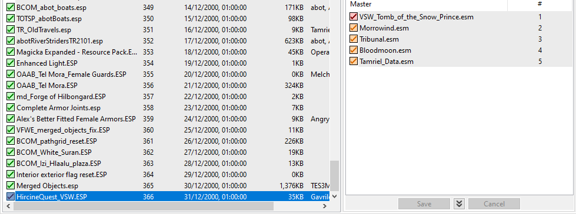
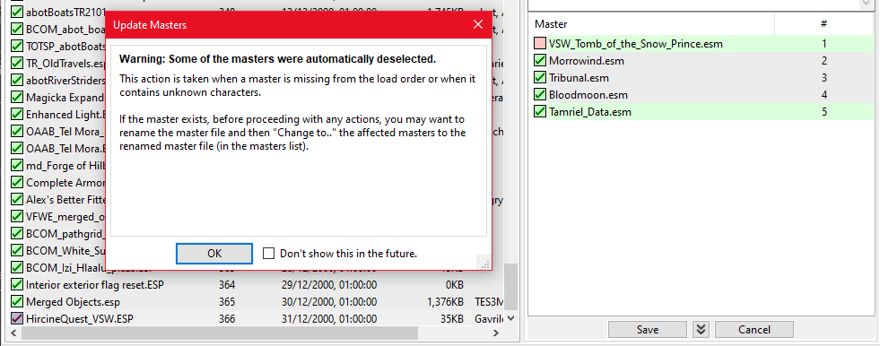

# Quests

## Rebalances

⭐ [**Morrowind Anti-Cheese (Sig Edit)**](https://www.nexusmods.com/morrowind/mods/49232)\
Fixes some of the biggest exploits and balance issues in the game.


[**Link**](https://www.nexusmods.com/morrowind/mods/47305) to original mod by **Half11** and **Remiros**. The featured version includes fixes and tweaks by **Sigourn**.


⭐ [**Beware the Sixth House (Sixth House Overhaul)**](https://www.nexusmods.com/morrowind/mods/46036)\
Makes the Sixth House, properly, the most difficult content in the game.

⭐ [**Beware the Sixth House Tweaks**](https://www.nexusmods.com/morrowind/mods/49232)\
Fixes a number of inconsistencies with the mod's creature edits.

⭐ [**Tribunal Rebalance**](https://www.nexusmods.com/morrowind/mods/45713)\
Rebalances Tribunal as if it shipped with Morrowind. Intended to be used with Beware the Sixth House.

⭐ [**Bloodmoon Rebalance**](https://www.nexusmods.com/morrowind/mods/45714)\
Rebalances Bloodmoon as if it shipped with Morrowind. Intended to be used with Beware the Sixth House.

* Files to install:
  * **Bloodmoon Rebalance - Patch for Purists version** (Main files)

⭐ [**Main Quest Overhaul**](https://www.nexusmods.com/morrowind/mods/46913)\
This mod overhauls the Main Quest.

## Fixes

⭐ [**The Publicans**](https://www.nexusmods.com/morrowind/mods/45410)\
Fixes several places in the vanilla game that are set up like inns, but in which Bethesda for some reason forgot to add the option to rent a room in.

⭐ [**Dual Faction Membership for NPCs**](https://www.nexusmods.com/morrowind/mods/49885)\
NPCs that actually belong to two factions will reflect this in their dialogue.

⭐ [**Nerevarine Service Refusal**](https://www.nexusmods.com/morrowind/mods/49528)\
Adds extra service refusal dialogue once you progress further into the main quest. Any member of the Tribunal Temple and House Redoran will refuse to offer you their services as long as the persecution of the Nerevarine is still going on, or in the case of the Redoran, until you become their Hortator.

* On MO2 installation, check the following options in the installer:
  * [x] 00 Morrowind Only
  * [x] 01 TR Version

⭐ [**Service Requirements Revised**](https://www.nexusmods.com/morrowind/mods/50715)\
Factions will refuse services to the player depending on their faction affiliation and rank. Certain services, such as guild travel and healer services, are exempt from such restrictions.

* Files to install:
  * **Service Requirements Revised** (Update files)

⭐ [**Greetings for No Lore**](https://www.nexusmods.com/morrowind/mods/46063)\
Replaces the three standard No Lore greetings with over sixty new ones, adding variety to dialogue.

⭐ [**Outfit Greetings Tweaked**](https://www.nexusmods.com/morrowind/mods/46066)\
Greetings regarding clothes are limited to clothiers, nobles and snooty High Elves.

⭐ [**No Beds for the Diseased**](https://www.nexusmods.com/morrowind/mods/49232?)\
Prevents the player from renting a bed if diseased, be it common, blight, or corprus disease.

⭐ [**FMI - Hospitality Papers Expanded**](https://www.nexusmods.com/morrowind/mods/46107) by [PoodleSandwich2](https://www.nexusmods.com/morrowind/users/45710542)\
Restores and expands the implied mechanic of Hospitality Papers required to conduct trade in Sadrith Mora.

⭐ [**FMI - NotAllDunmer**](https://www.nexusmods.com/morrowind/mods/47569) by [PoodleSandwich2](https://www.nexusmods.com/morrowind/users/45710542)\
Improves idle dialogue filtering so that not all Dunmer refer to themselves as slavers, and not all Argonians refer to themselves as slaves.

⭐ [**FMI - Caius Big Package**](https://www.nexusmods.com/morrowind/mods/47580) by [PoodleSandwich2](https://www.nexusmods.com/morrowind/users/45710542)\
Give Caius Cosades a package worthy of the Grand Spymaster of Vvardenfell.

## Main Quest

[**Blades Informant**](https://www.nexusmods.com/morrowind/mods/48084)\
Allows you to continue working for the Blades after Caius' departure and deliver useful information to them that you may have picked up during your travels.

[**EL1OT's New Supply Chests**](https://www.nexusmods.com/morrowind/mods/46253)\
This mod adds a new supply chest to Caius Cosades' house for members of the Blades, and modifies the contents of the Fighters' and Mages' Guild Supply Chests.

[**Rise of House Telvanni**](https://www.nexusmods.com/morrowind/mods/27545)\
This mod adds quests for the Telvanni Archmagister, allowing him/her to gain more political power and strengthen House Telvanni.

* Files to install:
  * **Rise of House Telvanni v1_52** (Main files)
  * **Flask mesh update** (Optional files)

* On MO2 installation, check the following options in the installer:
  * [x] Base Mod

[**Rise of House Telvanni - 2.0**](https://www.nexusmods.com/morrowind/mods/48225)\
This mod gives a much needed facelift to one of the greatest quest mods of all time - Rise of House Telvanni.

[**Roleplay Options for Great House Hlaalu**](https://www.nexusmods.com/morrowind/mods/45208) by [Caeris](https://www.nexusmods.com/morrowind/users/43442372)\
 Adds immersive dialogue options to Great House Hlaalu quests.

[**Hlaalu Rank Adjust**](https://mw.modhistory.com/download-87-5839) by Ithilien87\
Now there is a proper structure to House Hlaalu, with actual governers for Suran and Gnaar Mok, not just Caldera. The Treasury actually has a master now, and the Hlaalu quest givers have an official title. Rankings were adjusted to make more sense and now the player can actually become a Councillor - something that was impossible in the original game for some unknown reason.

## Factions

⭐ [**Religions Elaborated**](https://www.nexusmods.com/morrowind/mods/47843)\
Fleshes out the Imperial Cult and the Tribunal Temple.

⭐ [**Imperial Factions**](https://www.nexusmods.com/morrowind/mods/49855)\
An overhaul of the Mages Guild, Thieves Guild and Fighters Guild.

⭐ [**Balmora Guilds Expanded**](https://www.nexusmods.com/morrowind/mods/46859)\
Expands and redecorates the interiors of the Balmora mages and fighters guild (as well as minor changes to the Temple).

⭐ [**Fighters Guild Improved**](https://www.nexusmods.com/morrowind/mods/51409)\
This mod overhauls the Fighters Guild questline by improving the background and narrative side of most of its quests, as well as adding more variety and available choices to them.

* On MO2 installation, check the following options in the installer:
  * [x] Merged

[**Mage Robes**](https://www.nexusmods.com/morrowind/mods/45739)\
Many Mages Guild members will now wear the new robes and the player can acquire the robes through quests and purchase.

* On MO2 installation, check the following options in the installer:
  * [x] 00 Core
  * [x] 01 Automatic Add-Ons (MWSE)

[**Magical Missions**](https://www.nexusmods.com/morrowind/mods/38773)\
Members of the Mages Guild can now deliver a coded message, solve a murder, investigate a heist, barter with the Telvanni and retrieve a tome of dark power for the Master Wizard of Caldera

[**Thieves Guild Stash**](https://www.lonebullet.com/mods/download-thieves-guild-stash-v10-elder-scrolls-iii-morrowind-mod-free-43942.htm)\
This mod adds several "Thieves' Guild Stash" chests, similar to the Fighters' Guild Equipment Chests and Mages' Guild Supply Chests, next to some of the higher-ranking thieves.

⭐ [**Thieves' Guild Overhaul**](https://www.nexusmods.com/morrowind/mods/49944)\
A complete overhaul of the Thieves' Guild faction. New quests, tweaks for existing quests, items, and a lot more!

[**Carelessly Crazy Caldera Community**](https://www.nexusmods.com/morrowind/mods/47275)\
Adds a new shop, 2 new NPCs, 17 new quests to Caldera, and adds unique background, personality and dialogue to most of the NPCs of the town.

⭐ [**Imperial Legion Expansion**](https://www.nexusmods.com/morrowind/mods/44469)\
This mod is a complete overhaul of the Imperial Legion faction. New quests, items, NPCs and more.

⭐ [**Morag Tong Polished**](https://www.nexusmods.com/morrowind/mods/47041)\
The Morag Tong Guild is the most poorly written faction in Morrowind. This mod fixes that by giving the guild a much needed touch up.

## Misc

⭐ [**LDM - Racist Service Refusal**](https://www.nexusmods.com/morrowind/mods/50870)\
Camonna Tong NPCs will now refuse to provide services to Argonians and Khajiit unless at a very high disposition.

⭐ [**LDM - Context Matters**](https://www.nexusmods.com/morrowind/mods/48273)\
Edits, re-filters, or adds on to vanilla dialogue to add more situational nuance.

⭐ [**LDM - Choices and Consequences**](https://github.com/Lucevar/ldm) by [Lucevar](https://www.nexusmods.com/morrowind/users/3099525)\
Lucevar's Dialogue Mod for Morrowind

* Files to download:
  * **01 Choices and Consequences** (Github)
* Zip the files in the Folder  **01 Choices and Consequences** and install with MO2. (Ctrl+M)

[**Choice and Consequence - Rogues of Pelagiad**](https://www.nexusmods.com/morrowind/mods/51182)\
This mod adds several new options and tweaks for dealing with the two rogues at Pelagiad's Halfway Tavern.

[**Choice and Consequence - Shady Orcs of Caldera**](https://www.nexusmods.com/morrowind/mods/51445)\
This mod adds several new options and tweaks for dealing with Bugrol gro-Bagul and Bashuk gra-Bat.

[**Choice and Consequence - Other Friend in Deed**](https://www.nexusmods.com/morrowind/mods/51541)\
This mod adds several new options and tweaks for the "A Friend in Deed" quest in Vivec.

## Add-ons

⭐ [**BDC-Seyda Neen**](https://www.nexusmods.com/morrowind/mods/51133) by [Enclavekiller1](https://www.nexusmods.com/morrowind/users/20927579)\
Better Dialogue-Choices is a quest overhaul project focused on implementing rpg elements in dialogue while extending quests by giving the player multiple ways to complete them. This mod overhauls all Seyda Neen side quests.

* Files to install:
  * **BDC-Seyda Neen** (Main Files)
  * **BDC-SN Hotfix 2** (Update files)
  * **BDC-SN and Census and Excise Faction Compatibility** (Optional files)
  * **BDC-SN and LDM-Choices and Consequences Compatibility** (Optional files)

⭐ [**Census and Excise Office Faction**](https://www.nexusmods.com/morrowind/mods/46798) by [AliceL93](https://www.nexusmods.com/morrowind/users/4709296)\
 This mod gives you the opportunity to join the Census and Excise Office and do quests for them.

⭐ [**Even More Mysterious Killings in Vivec**](https://www.nexusmods.com/morrowind/mods/49661)\
The Mysterious Killings in Vivec quest now has a new reward and some more flavour for the murderer.

[**OAAB Brother Junipers Twin Lamps**](https://www.nexusmods.com/morrowind/mods/51424)\
Update of Brother Juniper's classic quest mod. Join the Twin Lamps and fight against slavery through ~20 new quests. Now with overhauled locations, bug fixes, and extra dialogue and quest choices.

[**A Conjurer's Calling**](https://www.nexusmods.com/morrowind/mods/51070)\
Follow a short questline to discover the nature of a recluse conjurer's mysterious research and gain magical rewards. Start by stumbling into in his lair on an island in the Azura's Coast region, north of the Grazelands.

[**A Hermits Request**](https://www.nexusmods.com/morrowind/mods/23714)\
To the west of Seyda Neen, along the bitter coast, there lives a hermit by the name of Thexn Akaasul. It would seem that Thexn has a series of tasks for any adventurous soul willing to seek him out, though they deal mostly with the necessities of life rather than adventures of the grandiose sort.

[**A Merchant's Whim**](https://www.nexusmods.com/morrowind/mods/51068)\
A merchant has set up shop outside of Vivec. Talk with him, and after some time he will ask you for some help with a personal matter from his past.

* On MO2 installation, check the following options:
  * [x] Core Files
  * **Alternate Location** -> No

[**Hostages**](https://www.nexusmods.com/morrowind/mods/47916)\
Adds hostages to random dungeons of Vvardenfell and the opportunity for you to free them.

📃 [**The Sanguine Rose**](https://www.nexusmods.com/morrowind/mods/46214)\
The Sanguine Rose adds a fully featured Daedric Quest for Sanguine, the prince of hedonistic revelry, debauchery, and passionate indulgences of darker natures. An Ordinator has been sniffing out Sanguine's shrine and he wants you to take care of the nosy do-gooder in an unconventional way.

* On MO2 installation, check the following options in the installer:
  * [x] 00 Core
  * [x] 02 MWSE ME Patch

📃 [**The Demon of Knowledge**](https://www.nexusmods.com/morrowind/mods/46126)\
A mysterious book has fallen into your possession… How did it get there? Who does it belong to? Follow the clues, as you find yourself taken away by a detailed, multilayered story steeped in TES Lore.

📃 [**Ministry of Clarity**](https://www.nexusmods.com/morrowind/mods/46093)\
A sprawling questline full of action and intrigue with a fully radiant quest system, new loot and more!

[**Hircine's Quest**](https://www.nexusmods.com/morrowind/mods/47651)\
Participate in the challenge of Hircine and hunt down his three aspects.

* On MO2 installation, check the following options in the installer:
  * [x] 00 Core
  * [x] 01 - Anthology

* Double click the mod in MO2 and go to the **Optional ESPs** tab, move to the left (make optional):
  * [x] `HircineQuest.ESP`



* Run Wrye Mash (**mash64**) in Mod Organizer 2.
* In the **Mods** tab, find `HircineQuest_VSW.ESP` and select it (It will have a red color).
* On the right-hand side, you will see a list of "Masters", click into it and a popup will display (click OK).
* Right click on `VSW_Tomb_of_the_Snow_Prince.esm` in the list of Masters > "Change To".
* Select `Solstheim Tomb of The Snow Prince.esm` in your Morrowind Data Folder (the current window).
* Click Save.



   
Screenshots

[**Join the Royal Guards**](https://www.nexusmods.com/morrowind/mods/50676)\
Become a Royal Guard and do quests for them.

[**Imperial Knights Faction**](https://www.nexusmods.com/morrowind/mods/50643)\
Adds the Imperial Knights into the game, as a joinable faction.

[**The Talos Cult Conspiracy**](https://www.nexusmods.com/morrowind/mods/47576)\
Join the Talos Cult and embark on a conspiracy to kill the emperor.

[**Vvardenfell Brotherhood**](https://www.nexusmods.com/morrowind/mods/47314)\
A mod that allows you to join the Dark Brotherhood on Vvardenfell, in a semi lore-friendly (it expands lore) and enticing story, that stays true to the vanilla vision.

[**What is something that can be perceived**](https://www.nexusmods.com/morrowind/mods/47598)\
Adds Dark Brotherhood armor to the members of the faction in Vvardenfell.

📃 [**Pimp My Shrine - The Daedric Legend of Vernaccus**](https://www.nexusmods.com/morrowind/mods/49173)\
A lore-friendly quest mod based on an in-game book brought to life, with dungeons, mind-bending puzzles, quests, Daedra, and the power to summon items from oblivion.

[**Failed Incarnates Pilgrimage**](https://www.nexusmods.com/morrowind/mods/48717)\
 Once you are a Clanfriend, speak to a Wise Woman to stat the pilgrimage.

[**Bounty Hunter Assignments**](https://www.nexusmods.com/morrowind/mods/46928)\
 Roleplay as a bounty hunter, and kill dangerous criminals and beasts for gold, all around Vvardenfell.

[**Silent Island**](https://www.nexusmods.com/morrowind/mods/50274)\
 This is a horror themed mod, with pirates, Sixth House, and romance. Though this mod plays fairly different, where many tough enemies can be killed by the environment. You can play the mod running and avoiding enemies the entire way, or kill every single one of them.

[**The Rise of the Tribe Unmourned**](https://www.nexusmods.com/morrowind/mods/45165) by [Caeris](https://www.nexusmods.com/morrowind/users/43442372)\
Dagoth Ur has been defeated, but the continued presence of the Sixth House still poses a threat to Morrowind. A lieutenant of the Tribe Unmourned has come out of the shadows in a sinister plot to resurrect Dagoth Ur.

* Files to install:
  * **Crown Edition** (Main Files)


This mod may currently be incompatible with **Beautiful Cities of Morrowind**. But both are such cool mods :(


[**After the Blight**](https://www.nexusmods.com/morrowind/mods/46099) by [Caeris](https://www.nexusmods.com/morrowind/users/43442372)\
The Sixth House have been defeated and Morrowind is saved. Yet, reports of a group of Ashlanders camped outside of Kogoruhn will lead the Nerevarine into a new story. Restore a fallen house, defeat a new enemy, and recover ancient artifacts.

* Files to install:
  * **Crown Edition** (Main Files)


This mod may currently be incompatible with **Beautiful Cities of Morrowind**. But both are such cool mods :(


[**Camonna Tong**](https://www.nexusmods.com/morrowind/mods/50740) by [Caeris](https://www.nexusmods.com/morrowind/users/43442372)\
Begin a tale about the largest criminal organization in Morrowind, the Camonna Tong. Vye for power in all influences of society by working together with the likes of Orvas Dren, the Kingpin.

[**Of Justice and Innocence**](https://www.nexusmods.com/morrowind/mods/34046)\
 In the small village of Dagon Fel there lives a woman by the name of Rinida Honwyer. She claims her poor, sweet innocent brother has been kidnapped by smugglers. This unfortunate outcome is a result of an unlikely series of events and her poor brother's own naivety. Now Rinida fears for her brothers life, sure that these smugglers mean nothing

* Double click the mod in MO2 and go to the **Optional ESPs** tab, move to the left (make optional):
  * [x] `Of Justice and Innocence.esp`

[**Aspect of Azura**](https://www.nexusmods.com/morrowind/mods/51079) by [MelchiorDahrk](https://www.nexusmods.com/morrowind/users/962116)\
Adds a Daedric helm bearing the aspect of Azura which you can acquire through a new quest which starts at the Holamayan Monastery near the Shrine of Azura. Explore the hidden depths below the shrine to become the Champion of Azura!

[**Apothecary's Demise**](https://www.nexusmods.com/morrowind/mods/44331)
Apothecary's Demise is a quest mod about choice, that starts in the quaint abode in the Ascadian Isles. Upon entering this nice Apothecary's Abode, you are greeted with a dead apothecary, and a note that reads: "Don't go in the cellar, under any circumstance!"

[**Astrologian's Guild**](https://www.nexusmods.com/morrowind/mods/51216)
Join a fully playable guild and gain ranks to the top. Included are several dungeons, some new and others extensions of existing ones.

[**Frozen in Time**](https://www.nexusmods.com/morrowind/mods/50077)
This quest will bring you back in time, to solve a mystery untouched for hundreds of years.

📜 [**Galerion's Tools**](https://www.nexusmods.com/morrowind/mods/47901)\
Visit an old but familiar face to embark on a quest to discover an ancient enchanting tool, created by Galerion the Mystic, and unlock an entirely new enchanting mechanic.

[**God of Worms**](https://www.nexusmods.com/morrowind/mods/48028)\
Introduces five new quests to investigate the Order of the Black Worm's presence in Vvardenfell.

[**Love in time of the daedra**](https://www.nexusmods.com/morrowind/mods/43635) by [HangHimHigher](https://www.nexusmods.com/morrowind/users/14318784)\
An open ended quest mod about love, death, Daedra, vengeance, and whiney Bosmer conmen.

* Double click the mod in MO2 and go to the **Optional ESPs** tab, move to the left (make optional):
  * [x] `NON1.LoveintheTimeofDaedra.v1.03.esp`
  * [x] `NON1.LoveintheTimeofDaedra.v1.03_Abot.esp`

[**Love in time of the daedra - TR patch**](https://www.nexusmods.com/morrowind/mods/48683) by [RandomPal](https://www.nexusmods.com/morrowind/users/59284071)\
An open ended quest mod about love, death, Daedra, vengeance, and whiney Bosmer conmen.

* Files to install:
  * **Love in time of the daedra - TR version**

[**Master of Puppets**](https://www.nexusmods.com/morrowind/mods/51393)\
Recover a stolen arcane tome from a renegade wizard and his magically animated puppet servants.

* Files to install:
  * **Master of Puppets** (Main Files)
  * **Master of Puppets-Better Typography** (Optional Files)

* Double click the mod in MO2 and go to the **Optional ESPs** tab, move to the left (make optional):
  * [x] `MasterofPuppets.ESP`

[**Sorcerer of Alteration**](https://www.nexusmods.com/morrowind/mods/51224)
Journey through this quest mod to improve your alteration magic.

📜 [**The Wabbajack**](https://www.nexusmods.com/morrowind/mods/44653)
Adds the legendary Wabbajack artifact!

[**Hunting Big Tooth (A Quest for Magical Starter Weapons)**](https://www.nexusmods.com/morrowind/mods/51457)
 In this Mod you meet a Dunmer near Balmora who sends you on a Hunt for Big Tooth. Your reward is a magical starter Weapon of your choice.
