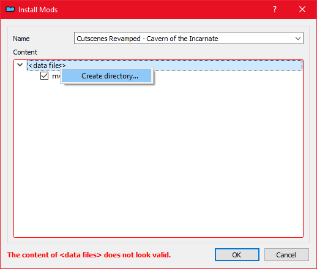

# UI

⭐📃 [**UI Expansion**](https://www.nexusmods.com/morrowind/mods/46071)\
Expands UI functionality with searching, filtering, and more visual feedback.

⭐ [**Cantons on the Global Map**](https://www.nexusmods.com/morrowind/mods/50534) by [mwclevername](https://www.nexusmods.com/morrowind/users/102938538)\
Vivec and Molag Mar no longer look like empty water on the global map.

⭐ [**Unstretched Videos**](https://www.nexusmods.com/morrowind/mods/50482) by [Necrolesian](https://www.nexusmods.com/morrowind/users/70336838)\
Adds black bars to the sides of the vanilla game videos, including the Bloodmoon videos, so they won't appear stretched when playing in widescreen (16:9).


This mod requires the **Mod Specific/Hi-def cutscene support** feature to be enabled in the Morrowind Code Patch.


[**Cutscenes Revamped - Cavern of the Incarnate**](https://www.nexusmods.com/morrowind/mods/49126)\
A modern HD replacer for the Azura Cutscene that plays in the Cavern of the Incarnate. Works with Morrowind and OpenMW.

* On MO2 installation, an installer window will pop up asking you to set a Data Files Directory. Right click on `<data files>` and select "Create directory".
* Type in "Video" to create the Video folder
* Move `mw_cavern.bik` into it

   
Screenshot


This mod requires the **Mod Specific/Hi-def cutscene support** feature to be enabled in the Morrowind Code Patch.


## Menus

⭐📃 [**Improved Main Menu**](https://www.nexusmods.com/morrowind/mods/50856)\
Adds several toggleable quality of life improvements to the Main Menu, including a Continue button and New Game confirmation prompts.

⭐ [**Title Screen and Logo Video Intro Reworked**](https://www.nexusmods.com/morrowind/mods/43657) by [Phobos90](https://www.nexusmods.com/morrowind/users/2470746)\
HD recreation of the Title and Logo Intro, in widescreen.

* Files to install:
  * **Title Screen Reworked (Widescreen)** (Main files)


In the **Setup** section we enabled the option to skip the intro movies, so there's no point in installing the Logo Video Intro Reworked (Widescreen) main file.


⭐ [**Widescreen Splash Replacer**](https://www.nexusmods.com/morrowind/mods/50966) by **NZdawghaus**\
 This is a repost of NZdawghaus' original Wide Screen Splash Replacer files. It is posted with direct specific permission from NZdawghaus. Gives 16:9 versions of vanilla Splash Screens.

⭐ [**Widescreen Splash Additions**](https://www.nexusmods.com/morrowind/mods/48001)\
Adds three missing Bethesda splash screens in widescreen resolution.

* On MO2 installation, create a **Splash** folder.
* Move the **.tga** files inside.

⭐ [**RFD's Splash Screens**](https://www.nexusmods.com/morrowind/mods/47400) by [RedFurryDemon](https://www.nexusmods.com/morrowind/users/46908543)\
Three packs of somewhat minimalist loading screens. Or splash screens. Whatever you call them.

⭐ [**Fresco Splash Screens**](https://www.nexusmods.com/morrowind/mods/45680) by [Petetehgoat](https://www.nexusmods.com/morrowind/users/25319994)\
This is a set of 14 splash screens showing off Tyddy's frescoes.

## Fonts and icons

⭐ [**Better Readable Beauty Font**](https://www.nexusmods.com/morrowind/mods/49201)\
High resolution replacer for the Magic Cards font, used in most of the user interface.


A more purist alternative to this mod is [**Better Dialogue Font**](https://www.nexusmods.com/morrowind/mods/36873).


⭐ [**Better Daedric Font**](https://www.nexusmods.com/morrowind/mods/44540)\
High resolution replacer for the Daedric font used in scrolls.

* On MO2 installation, create a **Fonts** folder.
* Move the **daedric\_font.fnt** and **daedric\_font\_obw.tex** files inside.

⭐ [**Comrade Raven's Book Arts Replacer**](https://www.nexusmods.com/morrowind/mods/48896)\
Replaces most of the original book arts with hi-res images redrawn from scratch.

* On MO2 installation, right-click on **Data Files**.
* Click **Set as data files directory** and click **OK**.

⭐ [**Comrade Raven's Book Arts Replacer ESP Replacer**](https://github.com/Sigourn/nerevarrising/blob/master/mods/Comrade%20Raven's%20Book%20Arts%20(PfP%20Edit).7z)\
Forwards PfP fixes to the plugin.


[**External Link**](https://github.com/Sigourn/nerevarrising/raw/master/mods/Comrade%20Raven's%20Book%20Arts%20(PfP%20Edit).7z) to the download.


[**Magic Icons**](https://www.nexusmods.com/morrowind/mods/50223)\
Replaces the effect seen on magic items in the inventory, allowing easier distinction between different magic items.

* On MO2 installation, check the following options in the installer:
  * [x] 00 Original Blue Color

📜 [**UI Expansion Better Training Icons**](https://www.nexusmods.com/morrowind/mods/51190) by [tewlwolow](https://www.nexusmods.com/morrowind/users/1152341)\
This mod replaces UI Expansion training menu icons with sharper, cleaner versions.

📜 [**Useful Maps and Guides**](https://www.nexusmods.com/morrowind/mods/51278) by [Lucevar](https://www.nexusmods.com/morrowind/users/3099525)\
Makes the "Guide to..." scrolls more useful by scripting them to reveal the cities on your world map.

* Files to install:
  * **Useful Maps and Guides** (Main files)
  * **TR Addon** (Optional files)

## HUD

⭐📃 [**Tamrielic Lore Tooltips**](https://www.nexusmods.com/morrowind/mods/45954) by [PhDinSorcery](https://www.nexusmods.com/morrowind/users/8404526)\
 Yagrum Bagarn's book Tamrielic Lore gives brief descriptions of the story behind several artifacts, all of which appear in-game. This mod adds excerpts from the book to the tooltips of each respective artifact.

⭐📃 [**Tooltips Complete**](https://www.nexusmods.com/morrowind/mods/46842) by [Anumaril21](https://www.nexusmods.com/morrowind/users/60236996)\
 Tooltips Complete provides helpful and lore-friendly flavour texts for nearly every item in Morrowind, Tribunal, Bloodmoon, the Official Plugins, and an expanding collection of mods.

* Files to install:
  * **Tooltips Complete** (Main files)
  * **Tamrielic Lore Exclusions** (Optional files)

⭐📃 [**MWSE Compare Tooltips**](https://www.nexusmods.com/morrowind/mods/51087) by [rfuzzo](https://www.nexusmods.com/morrowind/users/16300749)\
 This mod adds compare tooltips for looked-at or equipped items against the equipped item of the same category. The mod has multiple MCM options to configure the comparison style.

⭐📃 [**MWSE Loading Splash Screens**](https://www.nexusmods.com/morrowind/mods/51076) by [rfuzzo](https://www.nexusmods.com/morrowind/users/16300749)\
 This mod uses MWSE to display splash screens during cell loading instead of freezing the frame as vanilla does.

⭐📃 [**Travel Tooltips**](https://www.nexusmods.com/morrowind/mods/48306) by [tewlwolow](https://www.nexusmods.com/morrowind/users/1152341)\
 Adds tooltips with location descriptions and maps to travel menu.

⭐📃 [**Accurate Tooltip Stats**](https://www.nexusmods.com/morrowind/mods/51354) by [Necrolesian](https://www.nexusmods.com/morrowind/users/70336838)\
 Implements more accurate, context-dependent tooltip displays for weapon damage and armor ratings, using MWSE-lua.

📃 [**Essential Indicators**](https://www.nexusmods.com/morrowind/mods/48267)\
Provides configurable, dynamic crosshair indicators while sneaking and for essential NPCs, quest items, owned objects, and more. In addition, a variety of settings are included to manage how these aspects of the game work.

📃 [**Ownership Indicator**](https://www.nexusmods.com/morrowind/mods/45940)
Uses MWSE Lua to add an Oblivion style ownership indicator, when you look at owned items, beds, and more.

* On MO2 installation, an installer window will pop up asking you to set a Data Files Directory.
* Right click on `Data Files` and select "Set as < data files > directory".

* After installation, in MO2, go to **Filetree**:
* `MWSE\mods\ownership-indicator\main.lua` -> right click: **Hide**.

📃 [**More Detailed Companion HealthBars MWSE Lua Script**](https://www.nexusmods.com/morrowind/mods/51389) by [Spammer21](https://www.nexusmods.com/morrowind/users/140139148)\
Tweaked version of Mesafoo's Companion HealthBars, showing Magicka, Fatigue as well as currently selected weapon.

* Files to install:
  * **Compact Version** (Main files)

📃 [**HUD Weapon Charge**](https://www.nexusmods.com/morrowind/mods/47962)\
Adds a bar to the UI that shows the currently equipped weapon's charge under the weapon condition bar.

📃 [**Clocks**](https://www.nexusmods.com/morrowind/mods/50840)\
Adds a clock to the UI that displays either game world time or real time.

📃 [**No Disease Labels**](https://www.nexusmods.com/morrowind/mods/48295)\
Removes "Diseased", "Blighted", and similar adjectives from creature names using MWSE-lua.

## Gameplay

⭐📃 [**Alchemical Knowledge**](https://www.nexusmods.com/morrowind/mods/49036)\
Fixes gameplay and interface inconsistencies in the alchemy menu, provides it with a built-in effect filter and implements a Skyrim-like system for remembering ingredient effects.


This mod requires the **Game mechanics/Healty appetite** feature to be enabled in the Morrowind Code Patch.


⭐📃 [**Better Questlist**](https://www.nexusmods.com/morrowind/mods/48272)\
Allows highlighting and hiding quests in the Journal questlist.

⭐📃 [**What Are My Attributes (Necro Edit)**](https://github.com/Sigourn/nerevarrising/blob/master/mods/What%20Are%20My%20Attributes%20(Necro%20Edit).7z)\
Adds an Attribute and Description widget to the Race menu so you can better plan your character.


[**External Link**](https://github.com/Sigourn/nerevarrising/raw/master/mods/What%20Are%20My%20Attributes%20(Necro%20Edit).7z) to the download.



[**Link**](https://www.nexusmods.com/morrowind/mods/49912) to original mod by **RingComics**. The featured version includes UI fixes by **Necrolesian**.


⭐📃 [**Class Description Tooltip**](https://www.nexusmods.com/morrowind/mods/47527)\
Restores the class description tooltip to the class selection menu, making it easier to decide which class you want to go with.

⭐📃 [**Map and Compass**](https://www.nexusmods.com/morrowind/mods/48455)\
This mod allows you to replace the magical vanilla map with a selection of more mundane maps, and the minimap with a compass.



* Enter the **Mod config** menu in-game.
* Select **Map and Compass** from the mod list to the left.
* Click the **mapsWagner** tab.
* Under the **vvardenfellMapWagner** header, click the **Select** button to make it your currently selected map.
* Exit the menu.


⭐📃 [**Map Replacements for Maps and Compass Wagner Style - Brujoloco Edition**](https://www.nexusmods.com/morrowind/mods/48460)  
Replaces the maps from **Map and Compass** to give them a more immersive look.

* On MO2 installation, check the following options in the installer:
  * [X] 00 Yellowed Maps

⭐📃 [**Book Worm**](https://www.nexusmods.com/morrowind/mods/46851)\
Keep track of what books you have read by showing a **(Read)** indicator next to their names. You can also see a list of previously read books in the mod's Mod Config menu.

⭐📃 [**Shrine Tooltips**](https://www.nexusmods.com/morrowind/mods/48275)\
Adds tooltips with the effect's name to shrines when hovering over the different options.

⭐📃 [**Smart Journal**](https://www.nexusmods.com/morrowind/mods/47492)\
Adds several new options for the journal and quest pages.

* After installation, hide the mod's **Textures** folder.

⭐ [**Consistent Keys**](https://www.nexusmods.com/morrowind/mods/47954)\
Renames keys so they'll have a consistent naming scheme.

* Files to install:
  * **Consistent Keys - MWSE Version** (Main files)

⭐📃 [**Propylon Index Renamer**](https://www.nexusmods.com/morrowind/mods/49941)\
Renames propylon indexes so they'll group together in the inventory.

⭐ [**Soulgem Renamer**](https://www.nexusmods.com/morrowind/mods/49861)\
Renames soulgems so they'll group together in the inventory.

[**No Thank You**](https://www.nexusmods.com/morrowind/mods/49681)\
Adds a cancel button to Temple shrines and Imperial Cult altars.

## Hotkeys

⭐📃 [**Quick Equip**](https://www.nexusmods.com/morrowind/mods/48341)\
Adds a hotkey for equipping a selected inventory item.

⭐📃 [**Hotkeys Extended**](https://www.nexusmods.com/morrowind/mods/48055)\
Expands the amount of quick menu hotkeys available.

⭐📃 [**Right Click Menu Exit**](https://www.nexusmods.com/morrowind/mods/48458)\
Adds a hotkey for exiting any menu.

⭐📃 [**Security Enhanced**](https://www.nexusmods.com/morrowind/mods/47038)\
Adds hotkeys for lockpicks and probes, as well as hotkey cycling options, ordering options, and auto-equip options for activating locked or trapped objects.

⭐📃 [**Torch Hotkey**](https://www.nexusmods.com/morrowind/mods/45747)\
Adds a hotkey for equipping light sources, prioritizing already used lights.

📃 [**Kill Command**](https://www.nexusmods.com/morrowind/mods/46723)\
Adds a hotkey for summons, followers and companions to attack the selected target.

📃 [**Better Buoyancy**](https://www.nexusmods.com/morrowind/mods/48929)\
Add hotkeys for swimming and levitating. Use the jump key to float upwards, and the sneak key to sink downwards.

📃 [**Book Pickup**](https://www.nexusmods.com/morrowind/mods/46625)\
Adds a hotkey for picking up books.
