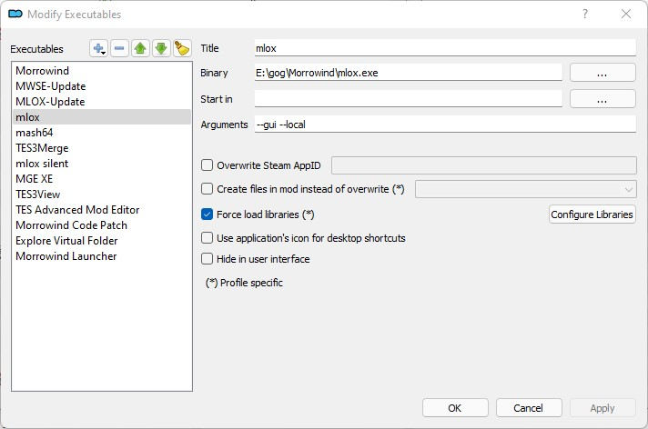

# Setup Tools


**BASED ON:** Sigourn @ [https://github.com/Sigourn/nerevarrising/blob/master/setup.md](https://github.com/Sigourn/nerevarrising/blob/master/setup.md)


This section contains tweaks to the morrowind ini and how to set up the modding tools properly in MO2.

## Adjusting Morrowind.ini

One of the patches we installed with the Morrowind Code Patch, **Rain/snow collision**, requires a few .ini edits to work properly.

In MO2:

* Click the **Tools** button, and click **INI Editor**. **morrowind.ini** will now open.
* Use CTRL+F to input the section names and edit the respective entries to use these values. Note that **Weather Snow** may be found much further down below than the others, just below the **Archives** section.

```text
[Weather Rain]
Rain Diameter=1200
Max Raindrops=1500

[Weather Thunderstorm]
Rain Diameter=1200
Max Raindrops=3000

[Weather Snow]
Snow Diameter=1600
Max Snowflakes=1500
```

* Click **Save** and close the window.

## Morrowind Code Patch setup

* Execute **Morrowind Code Patch.exe**, found in your **Root** folder.
* The **Morrowind Code Patch** will prompt you to install your patches of choice.
* Click **Apply chosen patches** when you are finished. Close the application.

Apply all patches **except** (optional, please read through the descriptions and decide for yourself):

* [ ] Beta/Doppler Audio Fix
* [ ] Game Mechanics/Followers defend immediately
* [ ] Visuals/Over-the-shoulder third person camera
* [ ] Mod Specific/Weapon resistance change
* [ ] Mode Specific/NPC AI casts zero cost powers
* [ ] Interface/Spell select by name
* [ ] International -> select as you wish/need

## Registering tools in Mod Organizer 2

For our modding tools to work in Mod Organizer 2, we need to register and configure them.

* Click the **Modify Executables**  button.

### MLOX


Make sure you have mlox installed properly [as described here](./tools.md#⭐-mloxhttpsgithubcomrfuzzomloxreleaseslatest)


* Click the **Add an executable**  button and select _Add from file..._.
* Navigate to your Morrowind **Root** folder (`C:\Games\Morrowind`) and double click `mlox.exe`.
* Click **Apply**.

<details>   <summary>Screenshot</summary>



</details>

### Wrye Mash

* Click the **Add an executable**  button and select _Add from file..._.
* Navigate to `C:\Games\Morrowind\Mopy` and double click `mash64.exe`.
* Click **Apply** and then **OK**.

### TES3Merge

* Click the **Add an executable**  button and select _Add from file..._.
* Navigate to the `C:\Games\MorrowindPlusPlus\Tools\TES3Merge\TES3Merge.exe` file.
* In the **Start In** field, select your Morrowind **Root** folder (`C:\Games\Morrowind`).
* In the **Arguments** field, type `-i`.
* Click **Apply**, and repeat the process for the remaining tools.

Exlusion rules:

* Navigate to `C:\Games\Morrowind` and open `TES3Merge.ini` with some text editor.
* Find the section **[FileFilters]** and add the following:

```txt
[FileFilters]
; Tamriel_Data.esm = false
VFWE_merged_objects_fix.ESP = false
BCOM_pathgrid_reset.ESP = false
BCOM_White_Suran.ESP = false
BCOM_Izi_Hlaalu_plaza.ESP = false
Interior exterior flag reset.ESP = false
```

### MGE XE

* Click the **Add an executable**  button and select _Add from file..._.
* Navigate to your Morrowind **Root** folder (`C:\Games\Morrowind`) and double click `MGEXEgui.exe`.
* Click **Apply**.

## Configuring MGE XE in Mod Organizer 2

* In Mod Organizer 2, click on the executables dropdown menu to the left of the **Run** button, and select **MGE XE**.
* Click **Run** to run the executable.

### In-game tab



You may be tempted to enable **High detail actor shadows (buggy)**. As the name says, they are buggy and can be very taxing on your framerate. I don't recommend them.


### Config tab

* Click the **Report max AA and AF** under **Information** to get your graphics card's max antialiasing and anisotropic filtering levels.

### Graphics tab


Apart from the recommended settings (as seen on the image), there are a couple of options you should look out for.

#### Display

* You should select your resolution and refresh rate.
* Set your **Antialiasing** and **Anisotropic filtering** settings to the values reported in the **Config** tab.
* Turn **VSync** on to prevent screen-tearing.

#### Windowed mode

* Most users then to ALT+TAB during gameplay. However, if you want to maximize performance at the cost of stability when ALT+TABbing, you should uncheck this option.

#### Renderer

* Check **Enable shaders**.
* Higher **Menu UI scaling** settings will scale up the UI. If you are playing on high resolutions (1080p and higher) I recommend starting with values at 1,20.
* Lower **FPS Limiter** settings will increase the consistency of your framerate. I personally set it to **60**.

**Shader setup...**

* On the **Set active shaders** window, click **Modding >>>**. Double clicking on the **Available shaders** makes them **Active shaders**, meaning the game will run them.
* For now, set your shader combination as follows.

```text
SSAO HQ
Underwater Effects
Underwater Interior Effects
Sunshafts
```

* Click **Save** after setting up your shader chain.


Note that **Antialiasing**, **Anisotropic filtering**, **VSync**, and **Enable shaders** will all take a heavy toll on your framerate.


### Distant Land tab

This tab lets you generate distant land, which in other words means you will see beyond the vanilla Morrowind fog. Tweaking these settings to achieve the optimal look can be difficult, and it boils down to personal taste. Distant Land can really hurt your FPS, especially when used alongside shaders, as there's more to post-process.

All options minus **Use Distant Land** and **Distant land generator wizard** are disabled when you get to this tab. We need to generate distant land for these options to become available.

* Click **Distant land generator wizard**.
* On the **Distant Land Setup Wizard**, click **Select all**. The checked plugins will be used for distant land generation.
* Click **Continue**. This will open the **Distant Land Generation** window.
* In the **Land Textures** tab, simply click **Create Land Textures**. By default, the options you should see are 2048 and 1024 texture and normalmap resolution, respectively.
* In the **Land Meshes** tab, select **Ultra High** from the **World mesh detail** dropdown menu. Click **Create Land Meshes**.
* In the **Statics** tab:
  * Set **Minimum Static Size** to 100.
  * Check **Include reflective water in interiors**.
  * Check **Use lists of statics overriding parameters set above**.
  * Click **Edit list**.
    * Click **Add**.
    * Navigate to your **Morrowind\mge3** folder, and double-click **00\_main.ovr**.
    * Click **Save**.
  * Click **Create Statics**.
* Once the statics have been created, click **Finish**.


A rule of thumb is to regenerate your distant land any time you install or uninstall mods. Most importantly, the process will be much easier as you only need to click on **Run above steps using saved / default settings** the next time you are on the **Distant Land Generation** window. On your first distant land generation, MGE XE defaults to **Distant Land configuration setup...**.



Now that you are back on the **Distant Land** tab you will see all previously unavailable options are now enabled. To get you started, I recommend you copy the settings as shown in the image above. In the future you may want to modify them.


These draw distance settings will preserve the foggy aesthetic of vanilla Morrowind, which I recommend over the absurd draw distance seen in most modern Morrowind screenshots. If you are aching for a little bit of extra draw distance, I suggest increasing the **Draw Distance** to 5,0, and cranking up the **Above Water Fog** settings to Start 3,0 and End 5,0.



Note that Per-pixel lighting takes a heavy toll on your framerate. You can disable it entirely, or limit it to **Interiors only**.

